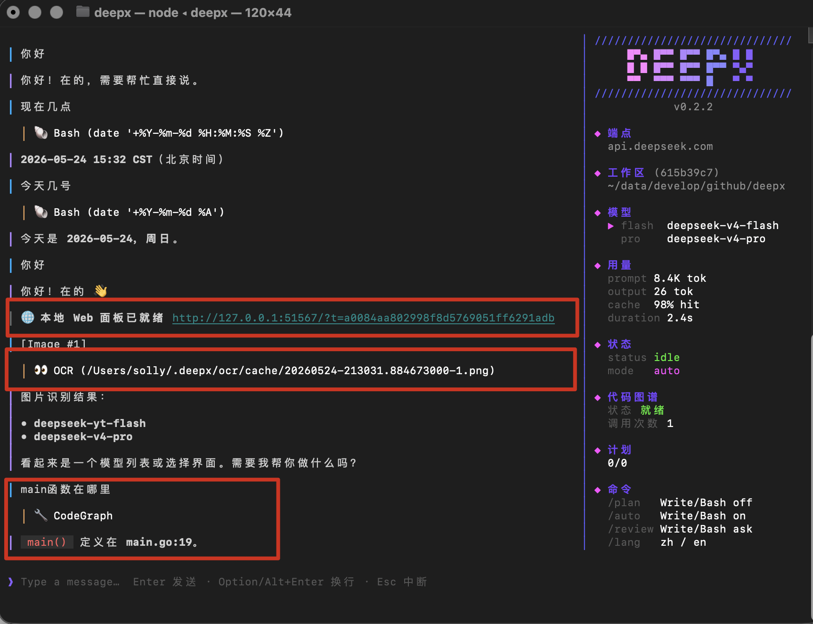

# deepx-code

[简体中文](README.md) | [English](README.en.md) | **日本語** | [한국어](README.ko.md)

> DeepSeek 標準装備のコーディングエージェント。ローカル OCR 画像認識、自動コンテキスト圧縮、ネイティブ codegraph 対応。トークン消費を根本から削減します。



## なぜ deepx か

- 🚀 Go 製で軽量・高速、全プラットフォーム対応。
- 🚀 gob バイナリ永続化。`tool_calls`、tool results、`reasoning_content` をすべて保持し、LLM がシームレスに再開。
- 🚀 階層圧縮 + 旧サマリーのマージ。
- 🚀 skill・MCP を標準装備、既存の Claude エコシステムにシームレスに統合。
- 🚀 ローカルキーワードルーティング。ゼロレイテンシ・ゼロトークンで、ヒットすれば即 pro に昇格。
- 🚀 自動モデル切替。問題の複雑さに応じて pro モデルへ自動昇格。
- 🚀 Plan DAG 並行スケジューリング。依存関係に従ってサブエージェントを並列実行し、各ノードが独自にモデルを選択。
- 🚀 ローカル OCR (PaddleOCR)。オフライン認識でマルチモーダル API に依存しない。
- 🚀 コードグラフ (codeGraph)。read/glob/grep によるトークンの無駄を大幅に削減。

## クイックスタート

### インストール

- macOS / Linux

```bash
curl -fsSL https://raw.githubusercontent.com/itmisx/deepx-code/main/scripts/install.sh | bash
```

- Windows (PowerShell)

```bash
irm https://raw.githubusercontent.com/itmisx/deepx-code/main/scripts/install.ps1 | iex
```

## 使い方

### ワークスペースに入る

```bash
cd <あなたのプロジェクトディレクトリ>
deepx
```

### DeepSeek API KEY の設定

初回起動時に設定ダイアログが表示されるので、そこで API key を設定します。

### Skill の設定

カレントディレクトリの `.deepx/skills/` に配置します。

### MCP の設定

`/mcp-add` コマンドで MCP を追加します。

## コアメカニズム

### モデルルーティング(ローカル、ゼロレイテンシ)

ユーザーメッセージが届くと、deepx はローカルでキーワードマッチング + 長さ判定を行います:

```
メッセージに "重构/refactor/architecture/调试…" を含む → 直接 pro に昇格
メッセージ長 < 100 文字                              → flash
メッセージ長 > 500 文字                              → pro
```

中国語(簡体/繁体)/ 英語 / 日本語 / 韓国語の 5 言語をカバー。**ルーティングは一瞬で行われ、追加の LLM トークンを一切消費しません。**

### セッション永続化(gob バイナリ)

```
~/.deepx/sessions/<sha1(workspace)[:16]>/
├── meta.json          # ワークスペースのメタ情報
├── state.json         # 圧縮状態 (summary + total_turns)
├── YYYY-MM-DD.jsonl   # テキストログ(Memory 検索用)
└── history.gob        # 完全なバイナリ履歴
```

| フォーマット       | 保存内容                                                                             | 用途                              |
| :----------------- | :----------------------------------------------------------------------------------- | :-------------------------------- |
| `history.gob`      | system + user + assistant(`tool_calls`、tool results、`reasoning_content` を含む)    | **再起動復元、LLM シームレス再開** |
| `YYYY-MM-DD.jsonl` | user / assistant プレーンテキスト(モード通知を含む)                                  | Memory ツール検索                 |

再起動時は gob を優先して読み込み、失敗時は JSONL にフォールバック。system prompt が build 升級や skill 変更で変わった場合、gob 復元時に現在のバージョンへその場で置換されます。

### セッション圧縮

長い会話がコンテキストウィンドウの 70% を超えると自動でトリガー。末尾を階層的に約 20K トークン保持し、古い内容を LLM 生成の一貫したサマリーへ圧縮して既存サマリーとマージします。**圧縮後は gob も同期更新**され、再起動後も一貫します。

### Plan DAG 並行スケジューリング

モデルは `CreatePlan` ツールで複雑なタスクを DAG ノードに分割し、deepx は依存関係に従って並行サブエージェントを起動します:

```
PlanCreated
  ├─ plan-1: Read (flash) ─────┐
  ├─ plan-2: Read (flash) ─────┤
  ├─ plan-3: Grep (flash) ─────┤
  └─ plan-4: Write (pro) ──────┘ depends_on: [1,2,3]
```

### レビューモード(デフォルト)

| モード             | Write / Update / Bash | その他のツール | 切替コマンド |
| :----------------- | :-------------------- | :------------- | :----------- |
| `review`(デフォルト) | 手動 YES/NO 確認    | 自動実行       | `/review`    |
| `auto`             | 自動実行              | 自動実行       | `/auto`      |
| `plan`             | 無効                  | 自動実行       | `/plan`      |

### ローカル OCR

Ctrl+V で画像を貼り付け → deepx が自動でディスクに保存 → LLM が `OCR` ツール(PaddleOCR PP-OCRv5)で画像内のテキストを認識。初回は ~37MB のモデルを自動ダウンロードし、以降は秒単位で応答。**DeepSeek はマルチモーダル非対応であり、ローカル OCR が最大の弱点を補います。**

### コードグラフ

deepx はコードグラフエンジンを内蔵しています。モデルはシンボルレベルのナビゲーション + 呼び出し関係のクエリを直接行え、リポジトリ全体の grep やファイルを一つずつめくる作業を置き換えます。

**操作早見表**

| op             | 用途                       | 必須パラメータ              | 説明                                                  |
| :------------- | :------------------------- | :-------------------------- | :---------------------------------------------------- |
| `def`          | シンボルの定義場所         | `name`                      | 関数/型/メソッド/変数の定義位置                       |
| `refs`         | シンボルを使っているのは誰 | `name`                      | すべての参照(定義 + 呼び出し + 値の取得)             |
| `symbols`      | 名前でシンボルを曖昧検索   | `name`(任意), `kind`(任意)  | `kind` フィルタ: func/method/type/var/const/field     |
| `outline`      | ファイル内のシンボル一覧   | `path`                      | ファイルアウトライン                                  |
| `imports`      | ファイルが import するパッケージ | `path`                | 依存概要                                              |
| `callers`      | 関数を呼び出しているのは誰 | `name`                      | **関数変更時の影響範囲確認**、Go 暗黙インターフェースも網羅 |
| `callees`      | 関数が呼び出しているもの   | `name`                      | 関数内部の処理フローを理解                            |
| `implementers` | インターフェースの実装者   | `name`                      | Go 暗黙インターフェースを**シンボルレベルで正確に**、grep では出ない |
| `subtypes`     | 型を継承/埋め込んでいるもの | `name`                     | サブタイプ追跡                                        |
| `supertypes`   | 型の派生元                 | `name`                      | 親型 / 埋め込みインターフェース                       |
| `impact`       | シンボル変更が波及する下流 | `name`, `depth`(既定3)      | 推移閉包、blast radius 分析                           |
| `reindex`      | インデックス強制再構築     | —                           | キャッシュ異常時に手動トリガー                        |

**CodeGraph と Grep の使い分け**

| シーン                                |               使用                 |
| :------------------------------------ | :--------------------------------: |
| 関数/型/変数の定義または参照          |    ✅ CodeGraph `def` / `refs`     |
| 呼び出しチェーンの上流/下流           | ✅ CodeGraph `callers` / `callees` |
| インターフェース実装関係              |    ✅ CodeGraph `implementers`     |
| コード変更の影響範囲                  |       ✅ CodeGraph `impact`        |
| ファイル内のシンボル                  |       ✅ CodeGraph `outline`       |
| コメント/文字列/設定内のテキスト      |              ❌ Grep               |
| 非コードファイル(JSON/MD/Shell/YAML) |              ❌ Grep               |
| シンボル名が不確かで曖昧検索          |     ✅ `symbols` + `kind` フィルタ |

**対応言語**:Go(stdlib 精密解析) + TypeScript / JavaScript / Python / Java / Rust / C / C++ / C# / Ruby / PHP / Kotlin / Swift / Scala / Dart / Vue / Svelte。

**動作の仕組み**:起動時にバックグラウンドの `Prewarm` が自動でインデックスを構築し、ステータスバーに `loading → ready` を表示。ファイルが Write/Update ツールで変更されると `stale` とマークされ、次回クエリ時に増分再構築されます。結果は `ファイル:行`(シグネチャ/呼び出し元を含む)で表示し、上限を超えると自動で切り詰めてページングします。

## ツールセット

| 種類        | ツール                             |         plan | auto | review |
| :---------- | :--------------------------------- | -----------: | :--: | :----: |
| ファイル読込 | `Read` `List` `Tree` `Glob` `Grep` |            ✓ |  ✓   |   ✓    |
| コードグラフ | `CodeGraph`                        |            ✓ |  ✓   |   ✓    |
| ファイル書込 | `Write` `Update`                   |            ✗ |  ✓   |   ⏳   |
| Shell       | `Bash`                             |            ✗ |  ✓   |   ⏳   |
| ネットワーク | `Search` `Fetch`                   |            ✓ |  ✓   |   ✓    |
| メモリ      | `Memory`                           |            ✓ |  ✓   |   ✓    |
| スキル      | `LoadSkill`                        |            ✓ |  ✓   |   ✓    |
| 画像        | `OCR`                              |            ✓ |  ✓   |   ✓    |
| プランニング | `CreatePlan` `UpdatePlanStatus`    | LLM が自律呼出 |    |        |
| 昇格        | `SwitchModel`                      | LLM が自律呼出 |    |        |

> ⏳ = 自動実行だが手動確認が必要。

## Slash コマンド

| コマンド  | 作用                  |
| :-------- | :-------------------- |
| `/plan`   | 読み取り専用モードに切替 |
| `/auto`   | 全自動モードに切替    |
| `/review` | レビューモードに切替  |
| `/mode`   | 現在のモードを表示    |
| `/config` | API key を再設定      |
| `/skills` | 利用可能な skill を一覧 |
| `/help`   | ヘルプ                |

## Skills エコシステム

```
workspace レベル  <wd>/.deepx/skills/
global レベル     ~/.agents/skills/ → ~/.claude/skills/ → ~/.deepx/skills/
```

- workspace レベルは `git add` でチームに共有可能。
- global レベルは Claude Code エコシステムと互換、既存の skill をそのまま再利用。

## アーキテクチャ

```
単一ターン:
  ユーザー入力
    ↓
  RouteByKeyword (ローカル) ─► flash または pro
    ↓
  StartStream (メインループ)
    ├─ 直接回答
    ├─ ツール呼出 → review が write/Shell を遮断 → 実行 → 結果を還流 → 継続
    ├─ SwitchModel → pro に昇格
    └─ CreatePlan → DAG scheduler → サブエージェント並行 → 集約

セッション永続化:
  HistoryUpdateMsg → SaveGob (history.gob, 完全 fidelity)
  StreamDoneMsg  → Append JSONL (プレーンテキスト, Memory 検索)
  再起動         → LoadGob (優先) / JSONL (フォールバック)

セッション圧縮:
  tokens ≥ ctxWindow × 70% → runCompression (非同期)
    → 末尾を階層的に ~20K トークン保持
    → LLM が新旧サマリーをマージ
    → gob + state.json を更新
```

## トークン経済

- **ゼロトークンルーティング**:純粋にローカルキーワード、LLM 呼出なし。
- **ツールの事前注入なし**:`Memory` / `LoadSkill` は呼出時のみ context に入る。
- **極簡な system prompt**:ツール横断の規約 + workspace のみ。各ツールのトリガー条件はそれぞれの description に。
- **DeepSeek KV cache フレンドリー**:tools 配列はモードで変わらず、system prompt は gob 復元時にバージョンを認識。
- **コードグラフのネイティブ対応**:トークンの無駄を根本から削減。

## プロジェクト構成

```
deepx/
├── main.go
├── agent/          StartStream ツールループ + ルーティング + DAG スケジューリング + サブエージェント
├── config/         ~/.deepx/model.yaml の読み書き
├── session/        gob 永続化 + JSONL ログ + セッション圧縮状態
├── tools/          全ツール実装(読込/書込/検索/OCR/Memory/Skill/Plan/CodeGraph)
├── codegraph/      コードグラフ:定義ジャンプ / 呼出元検索 / 継承実装 / 影響範囲
├── skill/          マルチパス skill 発見とロード
├── ocr/            PaddleOCR ラッパー(ONNX Runtime)
├── tui/            bubbletea TUI(入力/描画/クリップボード/選択/ダッシュボード)
└── scripts/        インストールスクリプト
```

## アンインストール

```bash
# macOS / Linux
rm -f ~/.local/bin/deepx && rm -rf ~/.deepx

# Windows
# %LOCALAPPDATA%\Programs\deepx と %USERPROFILE%\.deepx を削除
```

## License

[MIT](LICENSE) © 2026 itmisx
